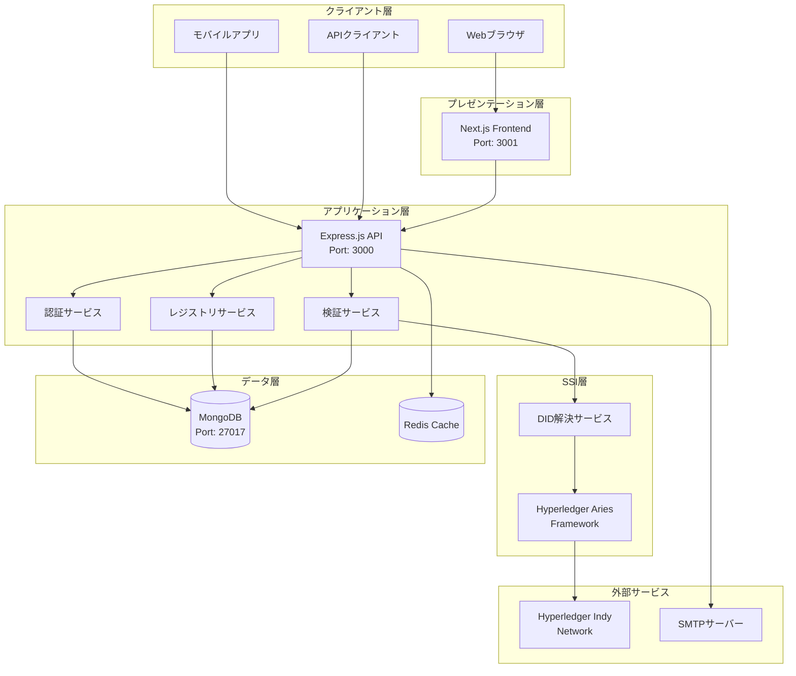
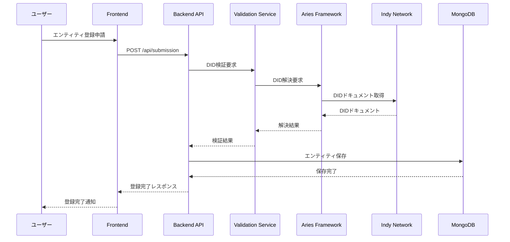
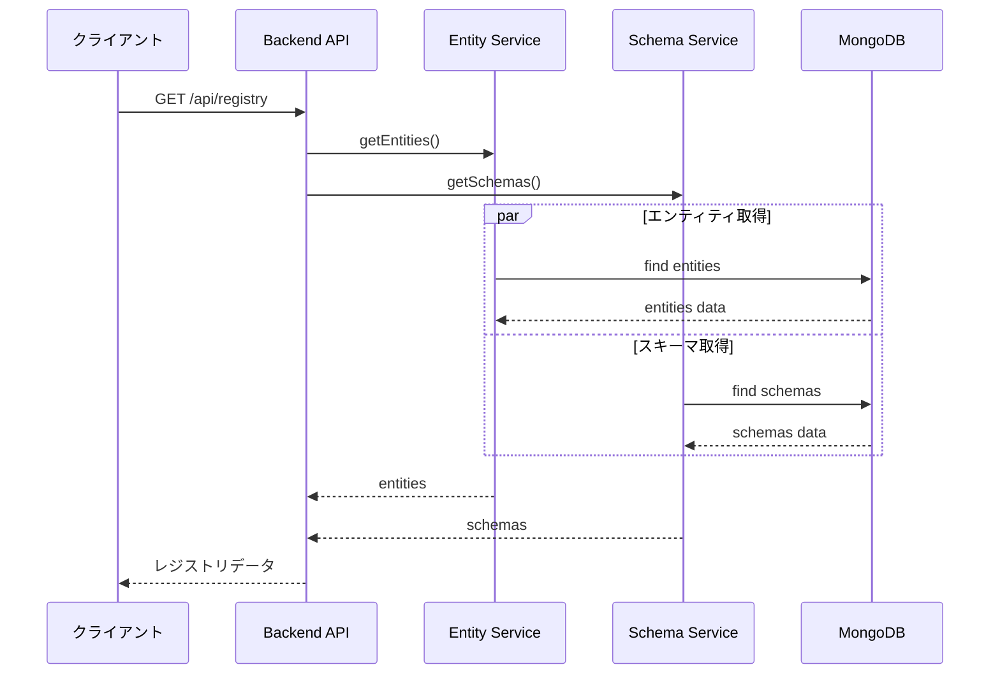
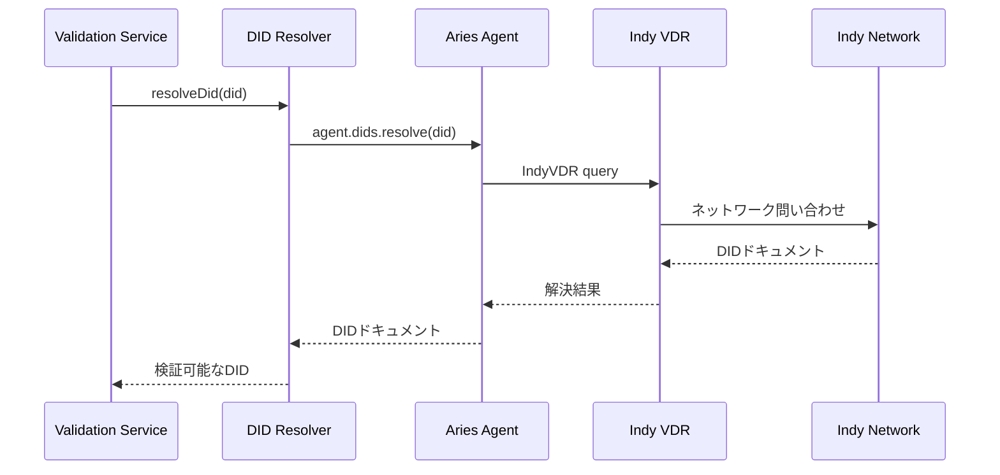
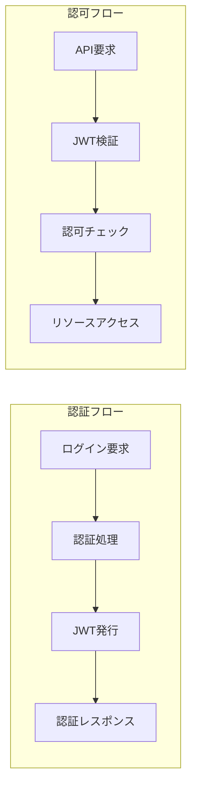
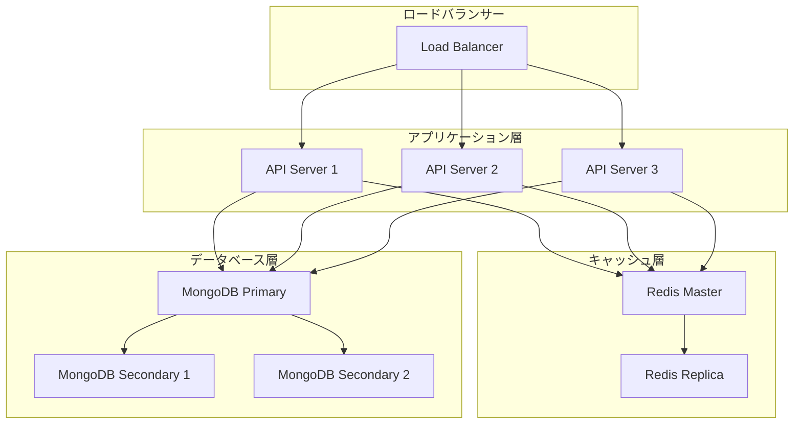
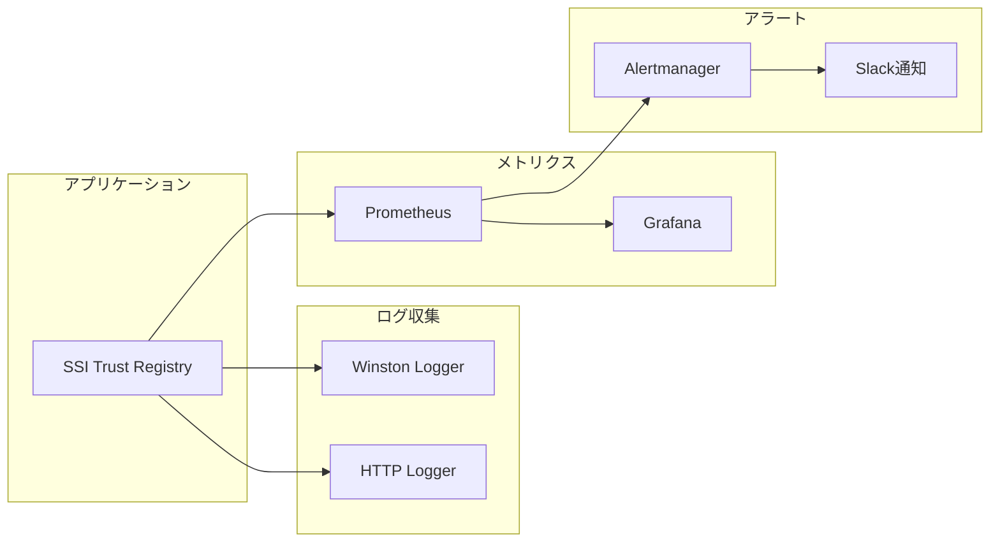

# アーキテクチャ解説

SSI信頼レジストリ（日本版）のシステムアーキテクチャについて詳しく解説します。

## 📋 目次

- [システム概要](#システム概要)
- [アーキテクチャパターン](#アーキテクチャパターン)
- [コンポーネント構成](#コンポーネント構成)
- [データフロー](#データフロー)
- [セキュリティアーキテクチャ](#セキュリティアーキテクチャ)
- [スケーラビリティ](#スケーラビリティ)

## 🏗️ システム概要

### 高レベルアーキテクチャ



### 設計思想

1. **分離関心の原則**: 各層が明確な責務を持つ
2. **マイクロサービス指向**: コンポーネントの独立性と再利用性
3. **API First**: フロントエンドとバックエンドの疎結合
4. **セキュリティバイデザイン**: 設計段階からのセキュリティ考慮
5. **スケーラビリティ**: 水平・垂直スケーリングへの対応

## 🔧 アーキテクチャパターン

### 1. レイヤードアーキテクチャ

```
┌─────────────────────────────────────────┐
│         プレゼンテーション層              │
│  (Next.js, React, TypeScript)          │
├─────────────────────────────────────────┤
│           アプリケーション層              │
│    (Express.js, Business Logic)        │
├─────────────────────────────────────────┤
│              サービス層                  │
│    (Entity, Schema, Validation)        │
├─────────────────────────────────────────┤
│              インフラ層                  │
│   (MongoDB, Aries, External APIs)      │
└─────────────────────────────────────────┘
```

### 2. ヘキサゴナルアーキテクチャ（一部採用）

```
     ┌─────────────┐
     │   外部API   │
     └──────┬──────┘
            │
    ┌───────▼───────┐
    │  アダプター層  │
    └───────┬───────┘
            │
    ┌───────▼───────┐
    │ アプリケーション│
    │     コア       │
    └───────┬───────┘
            │
    ┌───────▼───────┐
    │ リポジトリ層   │
    └───────┬───────┘
            │
     ┌──────▼──────┐
     │ データベース │
     └─────────────┘
```

## 🧩 コンポーネント構成

### フロントエンド（Next.js）

```
packages/frontend/
├── src/
│   ├── app/                 # App Router
│   │   ├── globals.css      # グローバルスタイル
│   │   ├── layout.tsx       # レイアウトコンポーネント
│   │   ├── page.tsx         # ホームページ
│   │   └── submit/          # 申請フォーム
│   ├── common/              # 共通コンポーネント
│   │   ├── components/      # UIコンポーネント
│   │   └── types/           # 型定義
│   ├── fixtures/            # テストデータ
│   └── api.ts              # APIクライアント
├── public/                  # 静的ファイル
└── package.json
```

#### 主要コンポーネント

1. **レイアウトシステム**
   - `RootLayout`: 全体レイアウト
   - `Header`: ナビゲーション
   - `Footer`: フッター

2. **フォームコンポーネント**
   - `SubmissionForm`: エンティティ申請フォーム
   - `FormTextInput`: テキスト入力
   - `TextArea`: テキストエリア
   - `Checkbox`: チェックボックス

3. **データ表示コンポーネント**
   - `EntityCard`: エンティティ表示カード
   - `SchemaList`: スキーマ一覧
   - `TrustRegistry`: レジストリ表示

### バックエンド（Express.js）

```
packages/backend/
├── src/
│   ├── auth/                # 認証機能
│   │   ├── controller.ts    # 認証コントローラー
│   │   └── middleware.ts    # 認証ミドルウェア
│   ├── entity/              # エンティティ管理
│   │   ├── service.ts       # ビジネスロジック
│   │   ├── mongoRepository.ts # データアクセス
│   │   └── validationService.ts # 検証ロジック
│   ├── schema/              # スキーマ管理
│   ├── submission/          # 申請管理
│   ├── registry/            # レジストリ機能
│   ├── did-resolver/        # DID解決
│   ├── email/               # メール機能
│   ├── server.ts           # サーバー設定
│   ├── database.ts         # DB接続
│   └── main.ts             # エントリーポイント
└── package.json
```

#### レイヤー構成

1. **コントローラー層**
   ```typescript
   // HTTP リクエストの処理
   export async function getRegistry(req: Request, res: Response) {
     const registry = await registryService.getRegistry()
     res.json(registry)
   }
   ```

2. **サービス層**
   ```typescript
   // ビジネスロジックの実装
   export async function addEntity(entityDto: EntityDto) {
     await validationService.validateDids(entityDto.dids)
     return await entityRepository.create(entityDto)
   }
   ```

3. **リポジトリ層**
   ```typescript
   // データアクセスの抽象化
   export async function findById(id: string): Promise<Entity | null> {
     return await collection.findOne({ id })
   }
   ```

## 🔄 データフロー

### 1. エンティティ登録フロー



### 2. 信頼レジストリ取得フロー



### 3. DID解決フロー



## 🔒 セキュリティアーキテクチャ

### 認証・認可フロー



### セキュリティ層

1. **ネットワークセキュリティ**
   - HTTPS/TLS暗号化
   - CORS設定
   - Rate Limiting

2. **アプリケーションセキュリティ**
   - JWT認証
   - パスワードハッシュ化（bcrypt）
   - 入力値検証（Zod）

3. **データセキュリティ**
   - MongoDB認証
   - 機密情報の環境変数管理
   - DID暗号学的検証

### セキュリティミドルウェアスタック

```typescript
app.use(helmet())           // セキュリティヘッダー
app.use(cors(corsOptions))  // CORS設定
app.use(rateLimit())        // レート制限
app.use(authMiddleware)     // JWT認証
app.use(validateInput)      // 入力値検証
```

## 📈 スケーラビリティ

### 水平スケーリング戦略



### パフォーマンス最適化

1. **キャッシュ戦略**
   ```typescript
   // Redis キャッシュの実装例
   async function getEntityFromCache(id: string) {
     const cached = await redis.get(`entity:${id}`)
     if (cached) return JSON.parse(cached)
     
     const entity = await entityRepository.findById(id)
     await redis.setex(`entity:${id}`, 3600, JSON.stringify(entity))
     return entity
   }
   ```

2. **データベース最適化**
   ```javascript
   // MongoDB インデックス設定
   db.entities.createIndex({ "dids": 1 })
   db.entities.createIndex({ "domain": 1 })
   db.schemas.createIndex({ "schemaId": 1 })
   ```

3. **コネクションプーリング**
   ```typescript
   // MongoDB 接続プール設定
   const client = new MongoClient(uri, {
     maxPoolSize: 10,
     minPoolSize: 5,
     maxIdleTimeMS: 30000,
   })
   ```

### モニタリングとログ



## 🔮 将来の拡張性

### 計画中の機能

1. **マルチテナント対応**
   - 組織ごとの分離
   - 権限管理の細分化

2. **APIバージョニング**
   ```
   /api/v1/registry  # 現在
   /api/v2/registry  # 将来版
   ```

3. **イベント駆動アーキテクチャ**
   ```mermaid
   graph LR
     SERVICE[サービス] --> EVENT[イベント発行]
     EVENT --> QUEUE[メッセージキュー]
     QUEUE --> HANDLER[イベントハンドラー]
   ```

4. **GraphQL API**
   ```typescript
   type Query {
     registry: TrustRegistry
     entity(id: ID!): Entity
     schemas: [Schema!]!
   }
   ```

---

**次のステップ**: [API仕様](API.md)でAPIの詳細を確認しましょう。 
